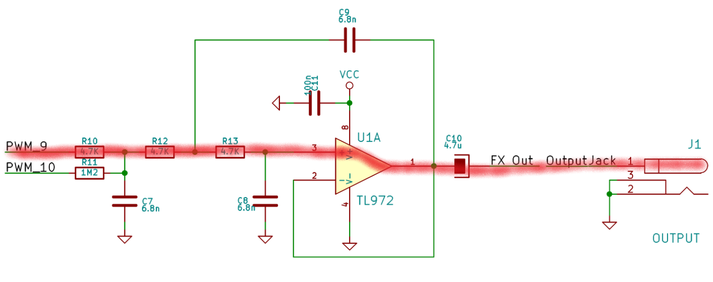
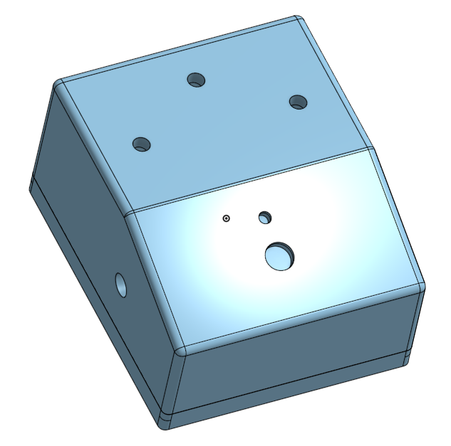

  
  &nbsp;&nbsp;&nbsp;&nbsp;
  
  &nbsp;&nbsp;&nbsp;&nbsp;
  

<h1 align="center">Arduino-programable-pedal-project</h1>

A project insipred by Electrosmash arduino guitar pedal.
The report is about the construction process of an amplifier and a lo-fi programmable guitar pedal using an Arduino UNO microcontroller. The amplifier contains a 100W speaker powered by a 9V battery through a home-made printed circuit board. It also contains a VU-meter to monitor the sound signal strength. All components are built into the housing, which is made with the help of a 3D printer. The guitar pedal is also made from a homemade printed circuit board that amplifies the signal coming from the guitar and prepares it for the Arduino's analog-to-digital converter. The Arduino receives the digitized signal, processes it into the desired form of guitar effect (distortion, fuzz, bitcrusher,...) and sends it to the connected output unit or amplifier. The program that processes the signal is written in the C programming language.
